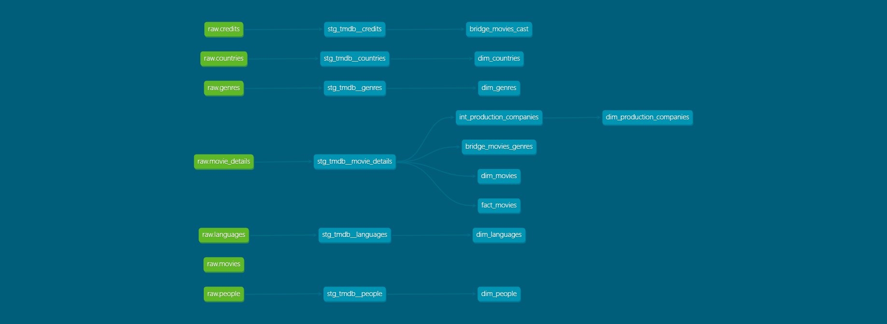

# TMDB Movie Analytics

> An end-to-end analytics engineering platform featuring TMDB API data.

# What This Is

This is an end-to-end analytics pipeline built around movie data from the 2000s onward. I chose this domain because I really got into movies this year and wanted to work with a domain I'm interested in. The project pulls data from the TMDB API, lands raw data in Parquet, and uses dbt (DuckDB adapter) to build a clean star schema for analytics.

With this pipeline, you can run analyses such as:
- Highest-ROI genres since the 2000s (revenue/budget)
- Top-grossing actors or studios
- Currently most popular actors/movies

These queries become straightforward because the project uses:
- dbt to clean, test, and structure the raw API output
- A Kimball-style star schema to flatten TMDB’s heavily nested records into well-defined dimensions, fact tables, and bridge tables
- Bridge tables for many-to-many fields like credits and genres, eliminating the need to unnest JSON arrays at query time
- Data quality tests that catch common TMDB API issues such as missing people records or duplicated fields
## Current Status

**What's working:** Core pipeline complete - Asynchronous API ingestion, dbt transformations with 18 models, dimensional modeling with bridge tables, comprehensive data quality tests.

**What I'm working on:** Refactoring ingestion to be modular

**What's next:** Either adding orchestration or migrating to GCP

## Tech Stack

- **Data Source:** [TMDB API](https://developer.themoviedb.org/docs/getting-started)
- **Storage:** DuckDB
- **Transformation:** dbt core
- **Frontend:** (tentative) 


## How It Works

This is a straightforward ELT pipeline: extract from TMDB API, load raw data into Parquet/CSV, transform with dbt, and visualize in a frontend (Rill, Tableau, etc).
```
TMDB API → Python Extraction → Parquet/CSV → dbt (DuckDB) → Frontend
```

**1. Data Ingestion (Python → Parquet/CSV)**

Fetch data from TMDB API endpoints and write to local files:
- **Movie details (with credits appended) → Parquet** - 
Core movie metadata, genres, crew, and cast all in a single API call using append_to_response=credits.

- **Discover movies → Parquet** used only to enumerate movie_ids for the details endpoint.
- **Genres, countries, languages → CSV** - Static reference data loaded as dbt seed tables.

The extraction uses async requests to increase throughput while respecting TMDB's rate limit (~40 requests per second). Added retry logic with for timeouts and network hiccups. Implemented with asyncio/aiohttp and tenacity.

Parquet files are read directly by dbt via DuckDB's native Parquet support - no intermediate database loading required.


**2. Data Transformation (dbt)**

**Staging layer** - Clean and standardize raw data from the movie_details_and_credits Parquet file (rename fields, fix data types, handle nulls). Three staging models extract different aspects of the mega-file: movie data, cast credits, and crew credits.

**Intermediate layer** - Unnest JSON arrays and deduplicate entities (people, production companies, etc.). Cast and crew are combined into a unified credits structure here.

**Marts layer** - Build analytics-ready models:
- **Dimensions**: movies, people, genres, countries, languages, production companies
- **Facts**: `fct_movies` (performance metrics: revenue, budget, ratings), `fct_credits` (cast and crew assignments with role details)
- **Bridge tables**: many-to-many relationships for genres, origin countries, and production companies

Bridge tables normalize fields that are frequently filtered or aggregated (genres, countries). Credits became a fact table since it captures events (who worked on what movie in what role) rather than just relationships.

Every model has tests: primary key uniqueness, not-null constraints, referential integrity checks.

**3. Analytics Frontend (Tentative)**

Building interactive dashboards to explore trends like ROI by genre, actor career earnings, and budget evolution over time.

## Data Models

The project uses a **Kimball-inspired star schema** optimized for movie analytics queries.

**Why star schema:**
I chose star schema because it's the gold standard for analytics, simplying the number of joins an analyst needs to make. 3NF would require a lot more joins and is more appropriate for an app, while One Big Table might cause a row explosion with all the nested fields.

**Design decisions:**
- **Bridge tables for genres, production_companies, and origin_countries** - These many-to-many relationships are queried constantly ("best performing genres", "top studios by revenue", "films by country"), so I normalized them into proper bridge tables
- **Unnested production companies from movie details** - TMDB's production_company endpoint was redundant with data already in movie_details, so I extracted and deduped companies directly from the nested JSON arrays in the intermediate layer
- **JSON for spoken_languages, production_countries, and belongs_to_collection** - Kept these as JSON in `dim_movies` rather than creating another bridge table since I don't have an analytics use-case for them yet. Avoided unnesting to keep the mart small.
- **Popularity as a snapshot** - Currently stored in `dim_people` as a point-in-time value. Might move to a dedicated fct_popularity table if I decide to track historical trends.

**Key models:**

**Dimensions:**
- `dim_movies` - Core movie info: title, release date, description, tagline
- `dim_people` - Cast and crew name, biography, popularity
- `dim_genres`, `dim_languages`, `dim_countries`, `dim_production_companies` - Reference data

**Facts:**
- `fct_movies` - Movie performance metrics: revenue, budget, vote counts. One row per movie.
- `fct_credits` - Cast and crew assignments with role details (character, job title, department, cast order). One row per unique credit.

**Bridges:**
- `bridge_movies_genres` - Movies ↔ Genres (many-to-many)
- `bridge_movies_origin_countries` - Movies ↔ Origin Countries (many-to-many)
- `bridge_movies_prod_companies` - Movies ↔ Production Companies (many-to-many)



## Getting Started

### You'll Need

- Python 3.8+
- dbt Core with DuckDB adapter (`pip install dbt-duckdb`)
- A TMDB API key ([grab one here](https://www.themoviedb.org/settings/api))

### Setup

**1. Clone and install**
```bash
git clone https://github.com/jacobjeffrey/tmdb-analytics.git
cd tmdb-analytics
pip install -r requirements.txt
```

**2. Environment config**
```bash
cp .env.example .env
# Edit .env with your TMDB API key
```

**3. Configure dbt**

Copy the example profiles file:
```bash
cp profiles.yml.example ~/.dbt/profiles.yml
```

Or manually create `~/.dbt/profiles.yml`:
```yaml
tmdb_analytics:
  target: dev
  outputs:
    dev:
      type: duckdb
      path: '../data/tmdb_analytics.db'
      threads: 4
      
      extensions:
        - parquet
        - httpfs
```

**4. Run the pipeline**
```bash
# Pull data from TMDB (writes to data/ directory)
python ingestion/ingest_tmdb.py

# Transform with dbt
cd dbt
dbt deps           # Install dbt packages (utils and expectations)
dbt seed           # Load reference data (genres, languages, countries)
dbt run            # Build models
dbt test           # Run data quality tests

# Check out the docs
dbt docs generate
dbt docs serve     # Opens on localhost:8080
```

**What gets created:**
- `data/tmdb_analytics.db` - DuckDB database with all transformed models
- `data/*.parquet` - Raw movie and movie_details data
- `data/seeds/*.csv` - Reference data for genres, languages, countries

## Project Structure

```
├── data/ 
├── dbt/
│   ├── models/
│   │   ├── staging/      # Staging models and tests
│   │   ├── intermediate/ # Intermediate models and tests
│   │   └── marts/        # Mart models (dim/fact/bridge) and tests
│   ├── dbt_project.yml
|   └── packages.yml
├── ingestion/            # API Fetching and Database Loading
├── frontend/             # TODO
├── notebooks/            # Jupyter notebooks for quick EDA and data validation
```

## Things I Learned / Gotchas

- **Async ingestion was a game-changer** - Switching from synchronous to asynchronous fetching cut ingestion time from 2+ hours to 30 minutes.

- **Pragmatic trade-offs beat perfectionism** - Initially tried fetching 400k people records for accurate popularity stats (3+ hours even with async). Realized averaging existing stats was good enough.

- **Parquet > CSV for messy data** - TMDB's description fields are full of newlines and special characters that broke Pandas' CSV parsing. Moving to Parquet and DuckDB really simplified this step for me.

- **RTFM saves time** - Discovered TMDB's `append_to_response` parameter halfway through the project. This allowed me to pull credits along with movie details, cutting ingestion time in half.


## Running This Yourself

**Note:** Initial ingestion takes ~30 minutes to fetch all movie data from TMDB's API.

**Feedback welcome!** This is a learning project and I'm always looking to improve. If you spot issues or have suggestions on the modeling, pipeline design, or code structure, feel free to open an issue or reach out.

## Credits

This product uses the TMDB API but is not endorsed or certified by TMDB.

.
---