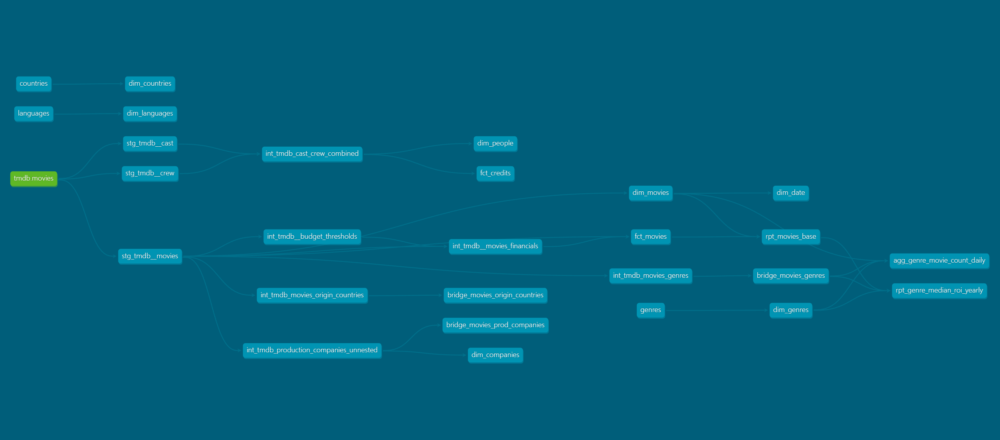

# TMDB Movie Analytics

> An end-to-end analytics engineering platform featuring TMDB API data.


# What This Is

This is an end-to-end analytics pipeline built around movie data from the 2000s onward. I chose this domain because I really got into movies this year and wanted to work with a domain I'm interested in. The project pulls data from the TMDB API, lands raw data in Parquet, and uses dbt (DuckDB adapter) to build a clean star schema for analytics.

With this pipeline, you can run analyses such as:
- Highest-ROI genres since the 2000s (revenue/budget)
- Top-grossing actors or studios
- Currently most popular actors/movies

These queries become straightforward because the project uses:
- dbt to clean, test, and structure the raw API output
- A Kimball-style star schema to flatten TMDB’s heavily nested records into well-defined dimensions, fact tables, and bridge tables
- Bridge tables for many-to-many fields like credits and genres, eliminating the need to unnest JSON arrays at query time
- Data quality tests that catch common TMDB API issues such as missing people records or duplicated fields
## Current Status

**What's working:** Core pipeline complete - Asynchronous API ingestion, dbt transformations with 18 models, dimensional modeling with bridge tables, comprehensive data quality tests. Ingestion refactored to be more modular and ready for the cloud (i.e. easily configurable for different environments). Containerization with Docker. **GCP deployment ready** – BigQuery-compatible dbt models and Terraform-provisioned GCP infrastructure (GCS, BigQuery, IAM). Orchestration coming next. Pipeline supports both local (DuckDB) and cloud (BigQuery) execution.

**What I'm working on:** Front-end (leaning towards Streamlit)

**What's next:** Cloud orchestration (Cloud Run/Cloud Functions)

## Tech Stack

- **Data Source:** [TMDB API](https://developer.themoviedb.org/docs/getting-started)
- **Ingestion:** Python (asyncio/aiohttp) with config-driven orchestration
- **Storage:** DuckDB (local) | Google Cloud Storage + BigQuery (cloud)
- **Transformation:** dbt core (DuckDB and BigQuery adapters)
- **Infrastructure:** Terraform (GCP resources)
- **Containerization:** Docker (dev and prod images)
- **Frontend:** (tentative) 


## How It Works

This is a straightforward ELT pipeline: extract from TMDB API, load raw data into Parquet/CSV, transform with dbt, and visualize in a frontend (Rill, Tableau, etc).

**Local Development:**
```
TMDB API → Python Extraction → Parquet/CSV → dbt (DuckDB) → Frontend
```

**Cloud Deployment (GCP):**
```
TMDB API → Python Extraction → GCS (Parquet) → dbt (BigQuery) → Frontend
```

**1. Data Ingestion (Python → Parquet/CSV)**

Fetch data from TMDB API endpoints and write to Parquet files:
- **Discover movies → Parquet** - Enumerate movie IDs by year (partitioned: `movies_2024.parquet`, etc.)
- **Movie details + credits → Parquet** - Core metadata in a single API call using `append_to_response=credits`
- **Genres, countries, languages → CSV** - Static reference data loaded as dbt seeds

Configuration managed via `config.yml` for environment-specific settings (rate limits, year ranges, data paths).

The extraction uses async requests to increase throughput while respecting TMDB's rate limit (~40 requests per second). Added retry logic with for timeouts and network hiccups. Implemented with asyncio/aiohttp and tenacity.

Parquet files are read directly by dbt via DuckDB's native Parquet support (local) or loaded into BigQuery (cloud) - no intermediate database loading required for local development.


**2. Data Transformation (dbt)**

**Staging layer** - Clean and standardize raw data from the movie_details_and_credits Parquet file (rename fields, fix data types, handle nulls). Three staging models extract different aspects of the mega-file: movie data, cast credits, and crew credits.

**Intermediate layer** - Unnest JSON arrays and deduplicate entities (people, production companies, etc.). Cast and crew are combined into a unified credits structure here.

**Marts layer** - Build analytics-ready models:
- **Dimensions**: movies, people, genres, countries, languages, companies
- **Facts**: `fct_movies` (performance metrics: revenue, budget, ratings), `fct_credits` (cast and crew assignments with role details)
- **Bridge tables**: many-to-many relationships for genres, origin countries, and production companies

Bridge tables normalize fields that are frequently filtered or aggregated (genres, countries). Credits became a fact table since it captures events (who worked on what movie in what role) rather than just relationships.

Every model has tests: primary key uniqueness, not-null constraints, referential integrity checks.

**3. Analytics Frontend (Tentative)**

Building interactive dashboards to explore trends like ROI by genre, actor career earnings, and budget evolution over time.

## Data Models

The project uses a **Kimball-inspired star schema** optimized for movie analytics queries.

**Why star schema:**
I chose star schema because it's the gold standard for analytics, simplying the number of joins an analyst needs to make. 3NF would require a lot more joins and is more appropriate for an app, while One Big Table might cause a row explosion with all the nested fields.

**Design decisions:**
- **Bridge tables for genres, production_companies, and origin_countries** - These many-to-many relationships are queried constantly ("best performing genres", "top studios by revenue", "films by country"), so I normalized them into proper bridge tables
- **Unnested production companies from movie details** - TMDB's production_company endpoint was redundant with data already in movie_details, so I extracted and deduped companies directly from the nested JSON arrays in the intermediate layer
- **JSON for spoken_languages, production_countries, and belongs_to_collection** - Kept these as JSON in `dim_movies` rather than creating another bridge table since I don't have an analytics use-case for them yet. Avoided unnesting to keep the mart small.
- **Popularity as a snapshot** - Currently stored in `dim_people` as a point-in-time value. Might move to a dedicated fct_popularity table if I decide to track historical trends.

**Key models:**

**Dimensions:**
- `dim_movies` - Core movie info: title, release date, description, tagline
- `dim_people` - Cast and crew name, biography, popularity
- `dim_genres`, `dim_languages`, `dim_countries`, `dim_production_companies` - Reference data

**Facts:**
- `fct_movies` - Movie performance metrics: revenue, budget, vote counts. One row per movie.
- `fct_credits` - Cast and crew assignments with role details (character, job title, department, cast order). One row per unique credit.

**Bridges:**
- `bridge_movies_genres` - Movies ↔ Genres (many-to-many)
- `bridge_movies_origin_countries` - Movies ↔ Origin Countries (many-to-many)
- `bridge_movies_prod_companies` - Movies ↔ Production Companies (many-to-many)



## Getting Started

### Quick Start with Docker (Recommended)

The fastest way to get up and running. No **local** Python installation or dependency management needed.

All Docker and dbt commands are wrapped in a Makefile for convenience and consistency.

**Prerequisites:**
- [Docker Desktop](https://docs.docker.com/get-docker/)
- A TMDB API key ([get one here](https://www.themoviedb.org/settings/api))

**Setup:**
```bash
git clone https://github.com/jacobjeffrey/tmdb-analytics.git
cd tmdb-analytics

# Add your TMDB API key. GCP variables are only required if running against BigQuery.
cp .env.example .env
# Edit .env with your API key

# Run the complete pipeline
make init      # First-time setup (builds container and starts services)
make pipeline  # Runs ingestion + dbt transformations
make dbt-docs  # View documentation at http://localhost:8080
```

That’s it! 🎉

**Common commands:**

```bash
make help       # See all available commands
make shell      # Enter the running container
make dbt-run    # Run dbt models
make clean      # Remove containers, volumes, and local data outputs
```

➡️ **[Full Docker documentation](DOCKER_SETUP.md)** for detailed setup, troubleshooting, and advanced usage.

---

### GCP Deployment

The pipeline is fully configured for Google Cloud Platform deployment with Terraform infrastructure provisioning.

**Prerequisites:**
- [Google Cloud SDK](https://cloud.google.com/sdk/docs/install) installed and authenticated
- A GCP project with billing enabled
- Terraform installed (`brew install terraform` or [download](https://www.terraform.io/downloads))

**Setup:**

1. **Provision infrastructure with Terraform:**

```bash
cd terraform

# Initialize Terraform
terraform init

# Review the plan (customize variables as needed)
terraform plan \
  -var="project_id=your-gcp-project-id" \
  -var="region=us-central1" \
  -var="dev_user_email=your-email@example.com"

# Apply infrastructure
terraform apply
```

This creates:
- GCS bucket for raw data storage
- BigQuery dataset (`tmdb_analytics`)
- Service account with appropriate IAM permissions
- IAM bindings for your dev user

2. **Configure environment variables:**

```bash
# Get outputs from Terraform
export GCS_BUCKET_NAME=$(terraform output -raw gcs_bucket_name)
export GCP_PROJECT_ID=$(terraform output -raw project_id)  # Or set manually
export BQ_LOCATION="us-central1"  # Match your region

# For production/service account auth
export GCP_KEYFILE_JSON='{"type":"service_account",...}'  # Service account key JSON
```

3. **Update ingestion config for GCS:**

Edit `tmdb_ingestion/config.yml`:
```yaml
filesystem:
  backend: "gcs"  # Change from "local" to "gcs"
  gcs:
    bucket: "your-bucket-name"  # From terraform output
    prefix: "tmdb_ingestion"    # Optional prefix
    auth:
      type: "oauth"  # or "service-account" for production
```

4. **Run the pipeline:**

```bash
# Using Docker (recommended)
make pipeline  # Uses dev_bq target by default

# Or locally
python -m tmdb_ingestion.ingest_tmdb
cd dbt
dbt deps
dbt seed --target dev_bq
dbt run --target dev_bq
dbt test --target dev_bq
```

**Production deployment:**

Use the production Dockerfile with service account authentication:
```bash
docker build -f Dockerfile.prod -t tmdb-analytics:prod .
docker run -e GCP_KEYFILE_JSON='...' -e GCP_PROJECT_ID='...' tmdb-analytics:prod
```


---

### Local Installation (Alternative)

Prefer to run without Docker? You’ll need to manage dependencies yourself.

**Prerequisites:**

* Python 3.10+ (3.11 recommended)
* dbt Core with DuckDB adapter (`pip install dbt-duckdb`)
* A TMDB API key ([get one here](https://www.themoviedb.org/settings/api))

**Setup:**

1. **Clone and install**

```bash
git clone https://github.com/jacobjeffrey/tmdb-analytics.git
cd tmdb-analytics

python -m venv .venv
source .venv/bin/activate  # On Windows: .venv\Scripts\activate

pip install -r requirements.txt
```

2. **Configure environment**

```bash
cp .env.example .env
# Edit .env with your TMDB API key
```

3. **Configure dbt**

Copy the example profiles file:

```bash
cp profiles.yml.example ~/.dbt/profiles.yml
```

> This step is **only required when running locally without Docker**.
> Docker users do not need to create a local dbt profile.

Example profile:

```yaml
tmdb_analytics:
  target: dev
  outputs:
    dev:
      type: duckdb
      path: "{{ env_var('DUCKDB_PATH', 'data/tmdb_analytics.db') }}"
      threads: 4
      extensions:
        - parquet
        - httpfs
```

4. **Run the pipeline**

```bash
python -m tmdb_ingestion.ingest_tmdb

cd dbt
dbt deps
dbt seed
dbt run
dbt test

dbt docs generate
dbt docs serve
```

**What gets created (local):**

* `data/tmdb_analytics.db` — DuckDB analytics database
* `data/*.parquet` — Raw and intermediate data
* `data/seeds/*.csv` — Reference data (genres, languages, countries)

**What gets created (GCP):**

* GCS bucket with Parquet files — Raw data storage
* BigQuery dataset with tables — Transformed analytics models
* Service account — For automated pipeline execution

## Project Structure
```
├── data/
│   ├── movies/
│   │   └── movies_*.parquet         # Partitioned by year
│   └── movie_details/
│       └── movie_details.parquet
├── dbt/
│   ├── models/
│   │   ├── staging/
│   │   ├── intermediate/
│   │   └── marts/
│   ├── seeds/                       # genres.csv, countries.csv, languages.csv
│   └── dbt_project.yml
├── tmdb_ingestion/                  # Package structure
│   ├── jobs/
│   │   ├── discover_movies.py
│   │   ├── fetch_movie_details.py
│   │   └── update_seeds.py
│   ├── ingest_tmdb.py              # Orchestration script
│   ├── utils.py
│   └── config.yml                   # Centralized config (supports local/GCS)
├── terraform/                       # GCP infrastructure as code
│   ├── main.tf                      # GCS bucket, BigQuery dataset, IAM
│   └── variables.tf                 # Configurable variables
├── Dockerfile.dev                   # Development container
├── Dockerfile.prod                  # Production container (BigQuery)
├── docker-compose.yml               # Local development setup
├── Makefile                         # Convenience commands
├── notebooks/
└── requirements.txt
```

## Things I Learned / Gotchas

- **Async ingestion was a game-changer** - When I was less aggressive with my movie filtering, switching from synchronous to asynchronous fetching cut ingestion time from 2+ hours to 30 minutes.

- **Config-driven architecture should've been day one** - Initially hardcoded everything (year ranges, API URLs, rate limits). Every parameter change meant editing source code. Refactoring to `config.yml` with CLI overrides eliminated constant file edits and made the codebase immediately deployment-ready. Wished I'd started with this pattern from the beginning.

- **Pragmatic trade-offs beat perfectionism** - Initially tried fetching 400k people records for accurate popularity stats (3+ hours even with async). Realized averaging existing stats was good enough.

- **Parquet > CSV for messy data** - TMDB's description fields are full of newlines and special characters that broke Pandas' CSV parsing. Moving to Parquet and DuckDB really simplified this step for me.

- **RTFM saves time** - Discovered TMDB's `append_to_response` parameter halfway through the project. This allowed me to pull credits along with movie details, cutting ingestion time in half.

- **BigQuery migration required SQL dialect changes** - Refactored all dbt models from DuckDB to BigQuery syntax (e.g., `UNNEST` in FROM clause, `STRUCT` types, `ARRAY_AGG`). The staging layer uses BigQuery-native functions while maintaining compatibility with the same data model structure.

- **Terraform for infrastructure** - Provisioning GCP resources (GCS, BigQuery, IAM) as code eliminated manual setup and ensures consistent environments. The config-driven ingestion pipeline seamlessly switches between local and GCS backends based on configuration.


## Running This Yourself

**Note:** Initial ingestion takes ~10 minutes to fetch all movie data from TMDB's API with the movie vote count threshold of 100. I found this is the sweet spot for filtering out low quality/obscure results while retaining more niche/arthouse films.

**Feedback welcome!** This is a learning project and I'm always looking to improve. If you spot issues or have suggestions on the modeling, pipeline design, or code structure, feel free to open an issue or reach out.

## Credits

This product uses the TMDB API but is not endorsed or certified by TMDB.


---
